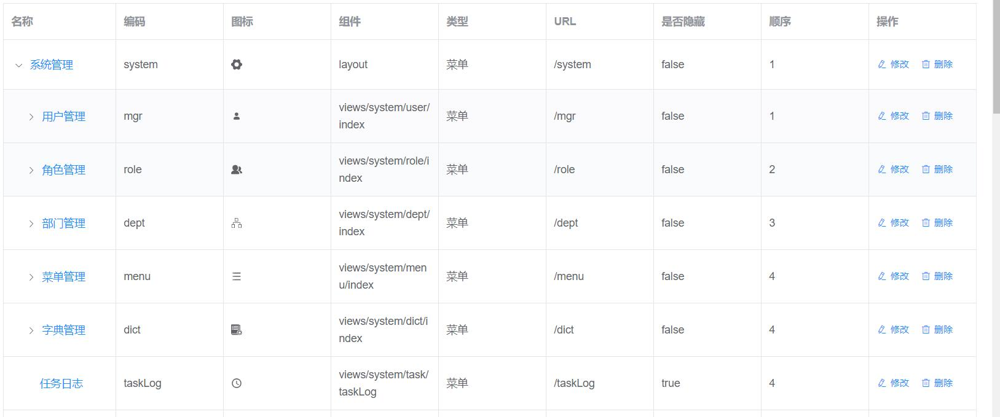
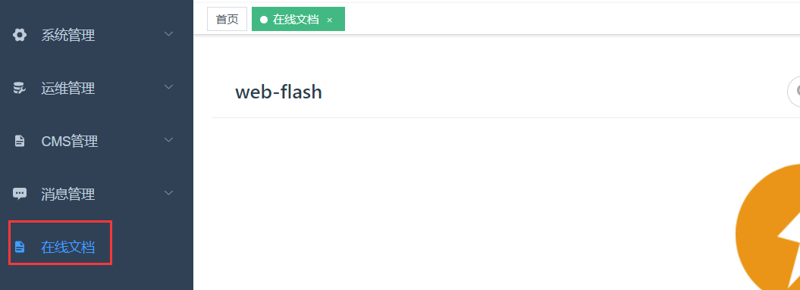

# 菜单管理

菜单管理包含两部分：一个是左侧菜单树的维护，一个是页面操作功能（主要是按钮）的维护。
不管是左侧菜单还是按钮，都需要在角色中进行配置才能正常显示出来。

先看下菜单列表大致了解下菜单管理都维护哪些内容：



## 左侧菜单维护
- 菜单维护基本上采用了两级菜单形式：如上图所示：第一级菜单为“系统管理”，“系统管理”中包含了“用户管理”、“角色管理”等多个二级菜单。
- 其中“系统管理”为虚拟菜单，点击“系统管理”并不会跳转到真实的页面而是展开其子菜单列表；所以虚拟菜单的组件属性应配置为“layout”。
- “系统管理”下的子菜单，为二级菜单，二级菜单都为真实的菜单，每个菜单对应真实的页面，下面以“用户管理”为例说明菜单中各个属性的作用：
  - **名称**：即菜单的名称，这里需要注意的是，默认情况下由于系统采用了国际化功能，因此菜单的名称并没有取自这里，而是根据src/lang/中的对应语言资源文件中“route”节点下的配置来展示，具体关联逻辑为，菜单的编号和配置文件进行关联。
  - **菜单编号**：菜单编号有两个作用：
    - 1.通过菜单编号和国际化资源文件中进行关联，实现菜单的多语言展示，例如用户管理的菜单编号是"mgr"，对应语言资源文件中的route.mgr的值的配置展示
    - 2.后台权限控制是根据菜单编号进行匹配的，例如在UserController中的list方法有下面配置：其中Permission.USER的值为“mgr”
      ```java
      @RequestMapping(value = "/list", method = RequestMethod.GET)
      @RequiresPermissions(value = {Permission.USER})
      public Object list(@RequestParam(required = false) String account,
                         @RequestParam(required = false) String name,
                         @RequestParam(required = false) Long deptid,
                         @RequestParam(required = false) String phone,
                         @RequestParam(required = false) Integer status,
                         @RequestParam(required = false) Integer sex
      ) {
          ...
      }
      ```
  - **资源地址**：资源地址都以斜杠“/”开头，资源地址也有两个用途：
    - 1.资源地址为浏览器中显示的地址，比如用户管理的资源地址为"/mgr",则演示环境用户管理的地址为"http://flash-admin.enilu.cn/#/mgr"
    - 2.资源地址作为前端权限控制的资源表示，比如用户管理下面有个三级菜单配置"添加用户"，资源地址为："/mgr/add",页面使用资源地址作为权限标识对"添加用户"按钮进行权限控制，控制代码如下：
    ```html
    <el-button type="success" size="mini" icon="el-icon-plus" @click.native="add" v-permission="['/mgr/add']">
      {{$t('button.add') }}
    </el-button>
    ```
      关于v-permission的具体用法在后面权限管理章节有具体描述。
  - 菜单类型：菜单类型包括“菜单”和“按钮”两类，本系统一级菜单和二级菜单的菜单类型基本都为“菜单”，比如系统管理，用户管理，角色管理，三级菜单的菜单类型都为“按钮”，比如添加用户，删除用户，分配角色等。
  - **图标**:菜单图标，只针对一级和二级菜单配置的图标才会生效，对按钮配置的图标不起作用
  - **排序**:菜单顺序，同样，只对菜单生效，不对按钮生效
  - **组件**:组件只对菜单生效，配置组件意味着当前菜单对应的vue界面；当然如果是虚拟菜单（基本上都是一级菜单）组件必须固定配置为layout，二级菜单配置为具体的页面组件路径，比如用户管理的组件配置为：views/system/user/index 组件配置必须为views开头，这也意味着开发的页面都必须放到views目录下。
- 左侧菜单完全通过后台配置的菜单数据生成，因此配置要显示在左侧菜单树的菜单之前，先保证该菜单对应的页面已经开发好，否则配置好菜单自动生成的时候可能会失败导致页面显示异常。

## 顶级菜单
- 左侧菜单默认采用二级菜单的模式，一级菜单为一个菜单目录，二级菜单为真实的菜单，菜单管理中配置的时候可以配置第三级，第三级一般配置为页面按钮，用于页面按钮的权限控制。
- 如果需要将一个菜单置为顶级菜单，也就是第一级就可以点击到具体的页面，则可以通过下面步骤进行配置
    - 首先配置一个一级菜单
    - 保证上面的一级菜单下面只有一个二级菜单，则生成左侧菜单树的时候会自动将该一级菜单下的二级菜单展示为一级菜单。请看下图示例：
    - 菜单管理中做如下配置：
    
    - 实际效果如下：
    

**注意**
- 本项目采用i18n国际化，左侧菜单的名称并没有使用上面配置的菜单名称，而是根据上面配置的菜单编码对应的国际化资源文件中的具体值：flash-vue-admin/src/lang/zh.js（en.js).
- 如果不想使用国际化，想直接从数据库中获取菜单名称作为左侧菜单树的名称，参考MenuService类中的transferRouteMenu 方法里的相关注释说明。
  ```java
  private List<RouterMenu> transferRouteMenu(List menus) {
              ***
              ***
              //如果使用前端vue-i18n对菜单进行国际化，则title設置为code，且code需要与国际化资源文件中route节点下的key值一致
              meta.setTitle(String.valueOf(source[8]));
              //如果不需要做国际化，则title直接设置后台管理配置的菜单标题即可
              //meta.setTitle(String.valueOf(source[3]));
              ***
              ***
  }
  ```
